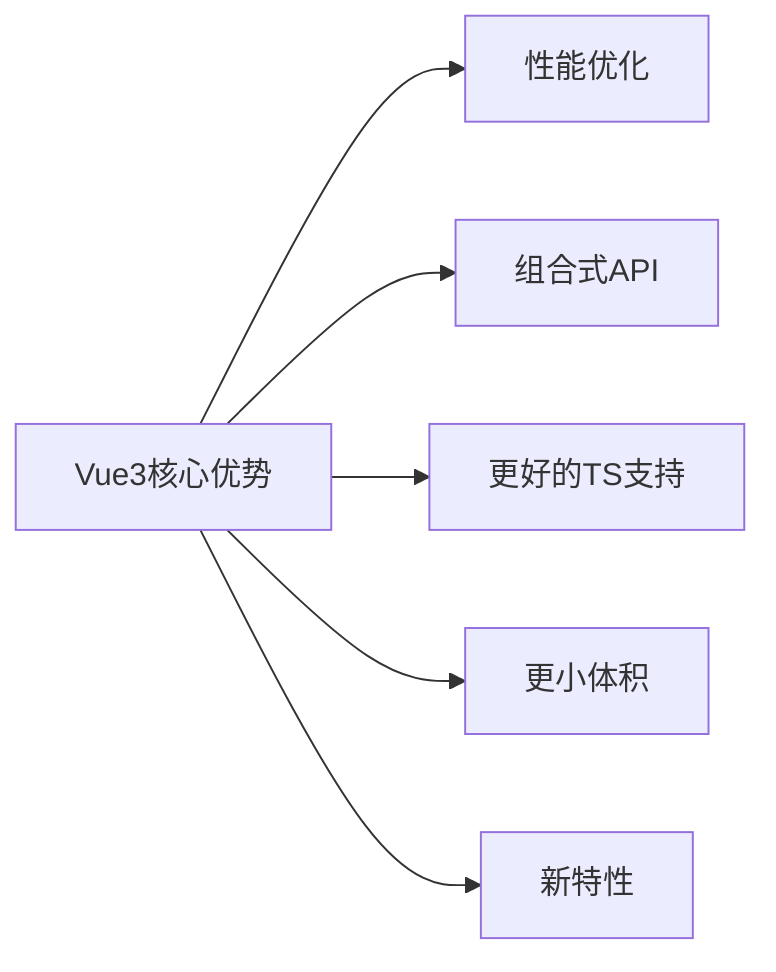
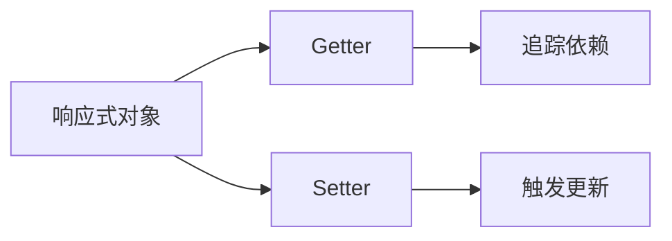

# Vue3 学习指南

## 目录
1. [Vue3 简介](#vue3-简介)
2. [环境搭建](#环境搭建)
3. [核心概念](#核心概念)
4. [组合式API](#组合式api)
5. [响应式系统](#响应式系统)
6. [组件开发](#组件开发)
7. [路由管理](#路由管理)
8. [状态管理](#状态管理)
9. [工具链](#工具链)
10. [最佳实践](#最佳实践)
11. [学习资源](#学习资源)

---

## Vue3 简介
Vue3 是一个现代化的 JavaScript 框架，于 2020 年 9 月正式发布。与 Vue2 相比，Vue3 带来了以下重大改进：

- **性能提升**：重写虚拟 DOM，优化编译过程
- **组合式 API**：更好的逻辑复用和代码组织
- **更好的 TypeScript 支持**：完整的类型推导
- **更小的体积**：Tree-shaking 支持，核心库约 10KB
- **新特性**：Fragment、Teleport、Suspense 等



---

## 环境搭建

### 1. 安装 Vue CLI
```bash
npm install -g @vue/cli
# 或
yarn global add @vue/cli
```

### 2. 创建项目
```bash
vue create my-vue-app
# 选择 Vue3 预设
```

### 3. 使用 Vite (推荐)
```bash
npm create vite@latest my-vue-app -- --template vue
# 或
yarn create vite my-vue-app --template vue
```

### 4. 项目结构
```
my-vue-app/
├── public/          # 静态资源
├── src/             # 源代码
│   ├── assets/      # 资源文件
│   ├── components/  # 组件
│   ├── router/      # 路由
│   ├── store/       # 状态管理
│   ├── views/       # 页面组件
│   ├── App.vue      # 根组件
│   └── main.js      # 入口文件
├── .gitignore
├── package.json
└── vite.config.js   # Vite 配置
```

---

## 核心概念

### 1. 选项式 API vs 组合式 API
| **选项式 API** | **组合式 API** |
|----------------|----------------|
| `data`, `methods`, `computed` 等选项 | `setup()` 函数组织逻辑 |
| 逻辑分散在不同选项 | 逻辑按功能组织在一起 |
| `this` 上下文 | 无 `this`，直接访问响应式变量 |
| Vue2 风格 | Vue3 推荐方式 |

### 2. 单文件组件 (SFC)
```html
<template>
  <div>{{ count }}</div>
  <button @click="increment">+1</button>
</template>

<script setup>
import { ref } from 'vue'

const count = ref(0)
const increment = () => count.value++
</script>

<style scoped>
button {
  padding: 8px 16px;
}
</style>
```

---

## 组合式API

### 1. `setup()` 函数
```javascript
import { ref, computed } from 'vue'

export default {
  setup() {
    const count = ref(0)
    const double = computed(() => count.value * 2)
    
    function increment() {
      count.value++
    }
    
    return { count, double, increment }
  }
}
```

### 2. `<script setup>` 语法糖 (推荐)
```html
<script setup>
import { ref } from 'vue'

const count = ref(0)
</script>
```

### 3. 常用 API
- **ref**: 创建响应式基本类型
- **reactive**: 创建响应式对象
- **computed**: 计算属性
- **watch/watchEffect**: 侦听器
- **provide/inject**: 依赖注入

```javascript
import { ref, reactive, computed, watch } from 'vue'

// 创建响应式变量
const count = ref(0)
const state = reactive({ name: 'Vue3' })

// 计算属性
const greeting = computed(() => `Hello, ${state.name}!`)

// 侦听器
watch(count, (newVal, oldVal) => {
  console.log(`Count changed from ${oldVal} to ${newVal}`)
})
```

---

## 响应式系统

### 1. 响应式原理


### 2. ref vs reactive
| **特性** | **ref** | **reactive** |
|----------|---------|--------------|
| 创建类型 | 基本类型 | 对象 |
| 访问值 | `.value` | 直接访问 |
| 解构 | 保持响应式 | 失去响应式 |
| 适用场景 | 基本类型、模板引用 | 复杂对象 |

### 3. 响应式工具
```javascript
import { 
  isRef, 
  unref, 
  toRef, 
  toRefs, 
  markRaw 
} from 'vue'

// 检查是否为 ref
isRef(count) // true

// 解包 ref
const unwrapped = unref(count)

// 对象属性转为 ref
const nameRef = toRef(state, 'name')

// 解构保持响应式
const { name, age } = toRefs(state)

// 标记非响应式
const staticObj = markRaw({ id: 1 })
```

---

## 组件开发

### 1. 组件通信
| **方式** | **描述** | **代码示例** |
|----------|----------|--------------|
| Props | 父 → 子 | `<Child :msg="message" />` |
| Emits | 子 → 父 | `emits('update', newValue)` |
| Provide/Inject | 跨层级 | `provide(key, value)` |
| Refs | 访问子组件 | `<Child ref="childRef" />` |
| Event Bus | 全局事件 | `mitt` 库 |

### 2. 插槽
```html
<!-- 父组件 -->
<ChildComponent>
  <template v-slot:header>
    <h1>标题</h1>
  </template>
  
  <template v-slot:default>
    <p>主要内容</p>
  </template>
</ChildComponent>

<!-- 子组件 -->
<div>
  <slot name="header"></slot>
  <slot></slot>
</div>
```

### 3. 内置组件
- **Teleport**: 传送组件到 DOM 其他位置
- **Suspense**: 异步组件加载状态处理
- **KeepAlive**: 缓存组件状态
- **Transition**: 动画过渡效果

```html
<Teleport to="#modal-container">
  <div class="modal">...</div>
</Teleport>

<Suspense>
  <template #default>
    <AsyncComponent />
  </template>
  <template #fallback>
    <div>Loading...</div>
  </template>
</Suspense>
```

---

## 路由管理

### 1. Vue Router 4
```bash
npm install vue-router@4
```

### 2. 基本配置
```javascript
// router/index.js
import { createRouter, createWebHistory } from 'vue-router'

const routes = [
  { path: '/', component: Home },
  { path: '/about', component: About }
]

const router = createRouter({
  history: createWebHistory(),
  routes
})
```

### 3. 路由使用
```html
<template>
  <router-link to="/">Home</router-link>
  <router-view />
</template>

<script setup>
import { useRoute, useRouter } from 'vue-router'

const route = useRoute() // 当前路由信息
const router = useRouter() // 路由实例

// 导航
router.push('/about')
</script>
```

---

## 状态管理

### 1. Pinia (推荐)
```bash
npm install pinia
```

### 2. 创建 Store
```javascript
// stores/counter.js
import { defineStore } from 'pinia'

export const useCounterStore = defineStore('counter', {
  state: () => ({ count: 0 }),
  actions: {
    increment() {
      this.count++
    }
  },
  getters: {
    double: (state) => state.count * 2
  }
})
```

### 3. 使用 Store
```html
<script setup>
import { useCounterStore } from '@/stores/counter'

const counter = useCounterStore()
</script>

<template>
  <div>{{ counter.count }}</div>
  <button @click="counter.increment">+1</button>
</template>
```

---

## 工具链

### 1. 开发工具
- **Vite**: 极速开发服务器
- **Vue DevTools**: 浏览器调试工具
- **ESLint**: 代码规范检查
- **Prettier**: 代码格式化

### 2. 测试工具
- **Vitest**: 单元测试
- **Cypress**: E2E 测试
- **Vue Testing Library**: 组件测试

### 3. UI 框架
- **Element Plus**: 企业级 UI
- **Vuetify**: Material Design 风格
- **Quasar**: 跨平台解决方案
- **Naive UI**: TypeScript 友好

### 4. 生态库
- **VueUse**: 常用组合式函数集合
- **Axios**: HTTP 客户端
- **Day.js**: 日期处理
- **Lodash**: 工具库

---

## 最佳实践

### 1. 代码组织
```javascript
// 按功能组织代码
export function useUser() {
  const user = ref(null)
  const loading = ref(false)
  
  async function fetchUser(id) {
    loading.value = true
    user.value = await api.getUser(id)
    loading.value = false
  }
  
  return { user, loading, fetchUser }
}
```

### 2. 性能优化
- 使用 `v-once` 静态内容
- 使用 `v-memo` 优化渲染
- 组件懒加载
- 合理使用计算属性

```html
<template>
  <div v-memo="[value]">
    <!-- 仅当 value 变化时更新 -->
  </div>
</template>
```

### 3. 安全实践
- 避免使用 `v-html` 防止 XSS
- 验证用户输入
- 使用 HTTPS
- 防止 CSRF 攻击

### 4. 项目结构优化
```
src/
├── composables/     # 组合式函数
├── layouts/         # 布局组件
├── plugins/         # Vue插件
├── services/        # API服务
├── utils/           # 工具函数
└── types/           # TypeScript类型定义
```

---

## 学习资源

### 1. 官方文档
- [Vue3 官方文档](https://vuejs.org/)
- [Vue Router 文档](https://router.vuejs.org/)
- [Pinia 文档](https://pinia.vuejs.org/)
- [Vite 文档](https://vitejs.dev/)

### 2. 教程与课程
- [Vue Mastery](https://www.vuemastery.com/)
- [Vue School](https://vueschool.io/)
- [慕课网 Vue3 教程](https://www.imooc.com/topic/vue3)

### 3. 社区资源
- [Vue 官方论坛](https://forum.vuejs.org/)
- [GitHub Vue 仓库](https://github.com/vuejs/core)
- [Vue 中文社区](https://vue-js.com/)

### 4. 实战项目
1. Todo 应用
2. 电商网站
3. 博客系统
4. 实时聊天应用
5. 后台管理系统

---

> 学习 Vue3 是一个循序渐进的过程。建议从基础开始，逐步深入组合式 API 和响应式系统，然后学习路由和状态管理，最后探索高级特性和性能优化。多动手实践是掌握 Vue3 的关键！
